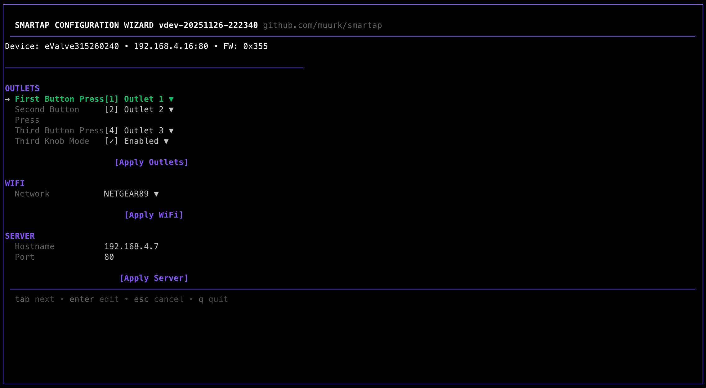

# What smartap-cfg Does

The `smartap-cfg` tool lets you configure your Smartap device without needing the original cloud service.

<figure markdown>
  { loading=lazy width="700" }
  <figcaption>The smartap-cfg wizard provides a friendly interface for configuring your device</figcaption>
</figure>

## What This Tool Does

- **Configure outlets** - Choose which water outlets turn on when you press each button
- **Configure WiFi** - Connect your device to your home network
- **Discover devices** - Find Smartap devices automatically

## What This Tool Does NOT Do

!!! warning "Hardware Issues"
    This tool configures software settings only. It **cannot fix**:

    - Low water pressure
    - Leaking valves
    - Physical diverter problems
    - Electrical issues
    - Any hardware malfunction

    If your shower had problems before the company shut down, this tool won't help.

!!! info "Smart Features"
    Basic outlet control works with just `smartap-cfg`. However, **advanced smart features** (remote control, scheduling, pre-heating) require:

    1. [Jailbreaking your device](../jailbreak/overview.md) (hardware modification required)
    2. [Running your own server](../server/overview.md) (experimental)

    If you just want basic outlet control, you're in the right place.

## Who Is This For?

### "My device lost its WiFi settings"

After a power outage or reset, the device may lose WiFi configuration. The wizard helps you set it up again.

### "I want to change which button does what"

Each button on your shower can be configured to control different outlets. The wizard lets you change these assignments.

### "I changed my WiFi password"

If you changed your home WiFi password, the device can no longer connect. Put it in setup mode and reconfigure with the new credentials.

## Requirements

- **Smartap device** that powers on (LEDs should light up)
- **Computer** (Windows, macOS, or Linux)
- **5-10 minutes** of your time

No technical expertise required. The wizard guides you through everything.

## Next Steps

[:material-download: Download smartap-cfg](download.md){ .md-button .md-button--primary }

---

## Not What You Need?

- **Want remote control and scheduling?** → [Device Jailbreak Guide](../jailbreak/overview.md)
- **Want to contribute to the project?** → [Contributing Guide](../contributing/overview.md)
- **Have questions?** → [FAQ](../about/faq.md)
